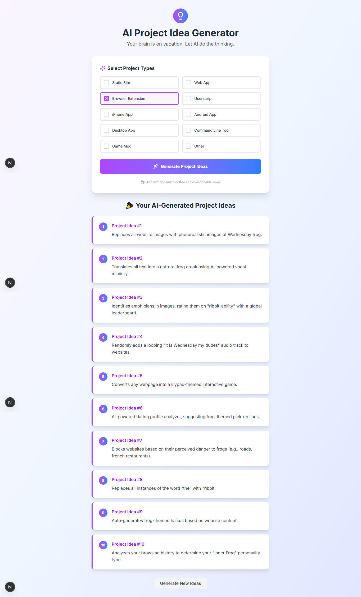

# AI Project Idea Generator - README



## Overview
A fun and creative AI-powered project idea generator built with Next.js that creates ridiculous, meme-worthy project suggestions. Perfect for hackathons, brainstorming sessions, or when you need inspiration with a twist!

## Features
- 💡 Generate 10 unique AI project ideas with one click
- 🎨 Customize ideas by project type (web, mobile, hardware, etc.)
- 🤖 Powered by Google Gemini AI
- 📱 Fully responsive design
- ✨ Modern UI with Tailwind CSS
- ⚡ Fast loading with streaming responses

## Technologies Used
- **Framework**: Next.js 15
- **Styling**: Tailwind CSS
- **Animation**: Framer Motion
- **AI Integration**: Google Gemini API
- **Deployment**: Vercel
- **Package Manager**: Bun

## Live Demo
[View Live Demo on Vercel](https://ai-project-idea-generator.vercel.app/)

## Getting Started

### Prerequisites
- Node.js v18+
- Bun package manager (`npm install -g bun`)
- Google Gemini API key (free from [Google AI Studio](https://aistudio.google.com/))

### Installation
```bash
# Clone the repository
git clone https://github.com/your-username/ai-project-idea-generator.git

# Navigate to project directory
cd ai-project-idea-generator

# Install dependencies
bun install

# Set up environment variables
cp .env.example .env.local
```

### Configure Environment
Edit the `.env.local` file:
```env
# Google Gemini API Key
GEMINI_API_KEY=your_api_key_here

# Optional: Add any other environment variables
```

### Running the Project
```bash
# Start development server
bun dev

# Build for production
bun build

# Start production server
bun start
```

## Project Structure
```
├── app
│   ├── api/project          # API route for generating ideas
│   ├── components           # React components
│   ├── globals.css          # Global styles
│   └── page.jsx             # Main page
├── public                   # Static assets
├── tailwind.config.js       # Tailwind configuration
└── postcss.config.js        # PostCSS configuration
```

## Customization
- **Modify prompt**: Edit `app/api/project/route.js` to change how ideas are generated
- **Change styling**: Update `tailwind.config.js` or modify components
- **Add project types**: Edit the `projectTypes` array in the main page component

## Contributing
Contributions are welcome! Please follow these steps:
1. Fork the repository
2. Create a new branch (`git checkout -b feature/your-feature`)
3. Commit your changes (`git commit -am 'Add some feature'`)
4. Push to the branch (`git push origin feature/your-feature`)
5. Open a pull request

## License
This project is licensed under the MIT License - see the [LICENSE](LICENSE) file for details.

---

**Enjoy generating wacky project ideas!** 🚀